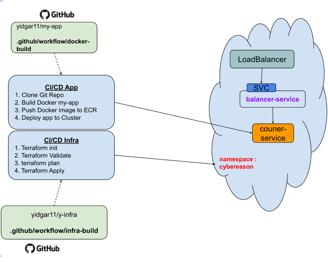
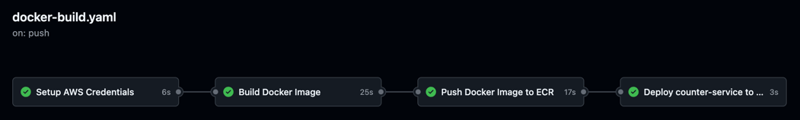
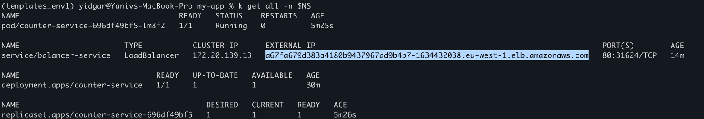
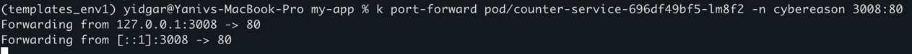
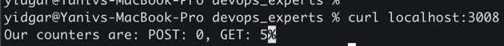
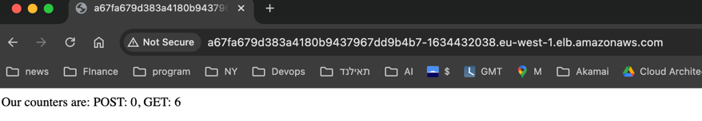
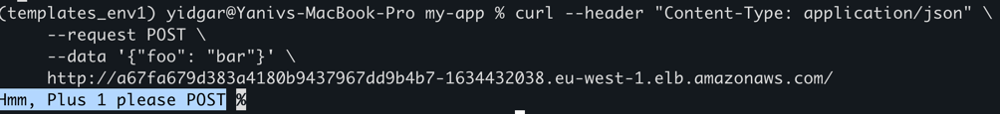

# my-app
Cybereason DevOps Exam -Application repository 

# Description 


# preparations 
## 1. Bash aliases and variables  
```sh
alias k="kubectl"
export NS="cybereason"
export region="eu-west-1"
export ecr_region="us-east-1"
```
## 2. Create ECR Repository

### 2.1 Login to ECR
```shell 
# For PUBLIC (Selected one) 
aws ecr-public get-login-password --region ${ecr_region} | docker login --username AWS --password-stdin public.ecr.aws/h3y5e4s1
``` 

### 2.2 Create PRIVATE OR PUBLIC repository in AWS for the flask-app
```shell
# For PUBLIC (Selected one)  
aws ecr-public create-repository --region ${ecr_region} --repository-name cybereason_exam/counter-service
```
## 3. add credentials in GitHub
	•	`AWS_REGION`
	•	`ECR_REPOSITORY_URI`
	•	`AWS_ACCESS_KEY_ID`
	•	`AWS_SECRET_ACCESS_KEY`


# Task Steps
## 1. Create Dockerfile to build the app 

## 2. Build the counter-service as a docker container 
```shell
docker build -t public.ecr.aws/h3y5e4s1/cybereason_exam/counter-service:1.0 .
```

## 3. Push it to an ECR repository (us-east-1)
```shell
docker push public.ecr.aws/h3y5e4s1/cybereason_exam/counter-service:1.0
```
## 4. Deploy the application image to Kubernetes 
update the image created in the deployment file 
Deploy i locally for test (minikube) 


## 4.1 Checks 
### Docker image 
#### Send POST,GET requests to check counters 
```shell
# Run the docker image 
docker run -d --rm --name test -p 443:443 TBD/my-app:1.0

# To add POST counts : 
curl --header "Content-Type: application/json" \
     --request POST \
     --data '{"foo": "bar"}' \
     http://localhost:80/
 
# To check POST counter status    
curl localhost:80/     
```

i.e 


### Minikube deployment
Same checks , after deploy app in local minikube
```shell
# To add POST counts : 
curl --header "Content-Type: application/json" \
     --request POST \
     --data '{"foo": "bar"}' \
     http://localhost:80/
 
# To check POST counter status    
curl localhost:80/     
```

## 5. Create github actions pipeline 
The pipeline will run upon creating a merge request

Pipeline steps 



## 6. To check the app
```shell
k get all -n $NS 
```


### 6.1 Verify pod is up 
### 6.2 check locally 
```shell
k exec -it pod/counter-service-696df49bf5-lm8f2 -n cybereason 3008:80

# In another shell tab : 
curl localhost:3008
```




### 6.3 check app from browser 
get the loadbalancer external ip and paste in browser 



check post request 
```shell
curl --header "Content-Type: application/json" \
     --request POST \
     --data '{"foo": "bar"}' \
     http://a67fa679d383a4180b9437967dd9b4b7-1634432038.eu-west-1.elb.amazonaws.com/
```
